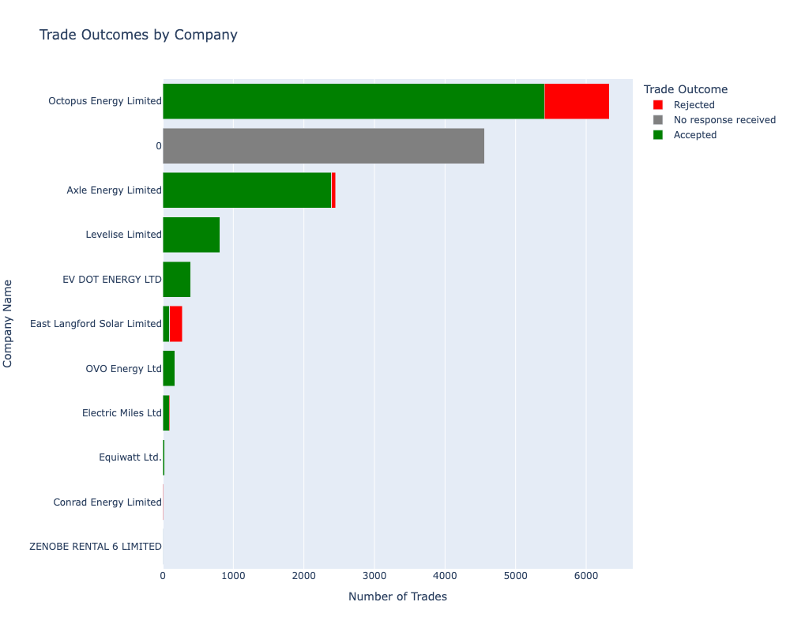

# NGED Flexibility-Trades-Data-EDA
Exploratory Data Analysis of flexibility trades in NationalGrid ED market.
This project analyzes data on flexibility products, technology types, and trading patterns across different energy companies.
**Key features**:
 - Data cleaning and preprocessing of flexibility trade records.
 - Analysis of trade volumes by company, technology type, and flexibility product.
 - Visualizations of trading patterns and market trends.
 - Statistical summaries and insights on flexibility market dynamics.

The analysis explores questions like:
 - Which companies are most active in flexibility trading?
 - What are the most common technology types and flexibility products?
 - How do trade volumes vary across different dimensions?
 - Are there any notable trends or patterns in the flexibility market?
   
**Tools used**: Python, Pandas, Matplotlib, Seaborn, Power BI

This repository contains Jupyter notebook with the full EDA process, from data loading to final visualizations and insights, and a Power BI file.

<u>**Features Dictionary**</u>

| Title                                     | Type    | Label | Description                                                               | Example                                 |
|-------------------------------------------|---------|-------|---------------------------------------------------------------------------|-----------------------------------------|
| CMZ Code                                  | text    | nan   | Unique Constraint Management Zone code                                    | CMZ_T4A_EM_0012                        |
| Flexibility Product                       | text    | nan   | Main flexibility product                                                  | Dynamic                                 |
| Trade Opportunity Name                    | text    | nan   | Name of trade opportunity                                                 | Winter 2023/24 - Dynamic - Coalville   |
| Trade Windows                             | text    | nan   | Name of the trade windows within the trade opportunity                    | "March 2024","November 2023"           |
| Trade Opportunity Delivery Start Date     | timestamp | nan   | Overall start date across all trade opportunity windows                   | 01/11/2023                             |
| Trade Opportunity Delivery End Date       | timestamp | nan   | Overall end date across all trade opportunity windows                     | 24/03/2024                             |
| Service Days Across All Windows           | text    | nan   | Days of the week with flexibility services requirements, across all windows | Monday,Tuesday,Wednesday,Thursday,Friday |
| Earliest Start Time                       | text    | nan   | Earliest start time across all trade windows                              | 08:30:00                               |
| Latest End Time                           | text    | nan   | Latest end time across all trade windows                                  | 18:30:00                               |
| Peak Tendered Capacity                    | numeric | kW    | Maximum capacity tendered for within the trade opportunity                | 1500                                    |
| Tendered Ceiling Availability Price       | numeric | £/MWh | Tendered availability ceiling price per MWh                                | 22.1                                    |
| Tendered Ceiling Utilisation Price       | numeric | £/MWh | Tendered utilisation ceiling price per MWh                                 | 1329.5                                  |
| Tendered Sustain Ceiling Price            | numeric | £/kW/season | Tendered price for Sustain per kW per season                             | 0                                       |
| Trade Open Date                           | timestamp | nan   | Trade opening date                                                        | 23/06/2023                             |
| Trade Close Date                          | timestamp | nan   | Trade closing date                                                        | 06/08/2023                             |
| Company Name                              | text    | nan   | Flexibility Provider Name                                                 | EV DOT ENERGY LTD                       |
| Offered Capacity [kW]                    | numeric | kW    | Offered capacity                                                          | 19                                      |
| Offered Availability Price                | numeric | £/MWh | Offered availability ceiling price per MWh                                 | 20.99                                   |
| Offered Utilisation Price                 | numeric | £/MWh | Offered utilisation ceiling price per MWh                                  | 1263                                    |
| Offered Sustain Price                     | numeric | £/kW/season | Offered price for Sustain per kW per season                             | 0                                       |
| Trade Outcome                             | text    | nan   | Outcome of trade, if applicable                                           | Accepted                                |
| Accepted Capacity [kW]                   | numeric | kW    | Accepted capacity                                                         | 19                                      |
| Awarded Availability Price                | numeric | £/MWh | Awarded utilisation price per MWh                                         | 22.1                                    |
| Awarded Utilisation Price                 | numeric | £/MWh | Awarded utilisation ceiling price per MWh                                  | 1329.5                                  |
| Awarded Sustain Price                     | numeric | £/kW/season | Awarded price for Sustain per kW per season                             | 0                                       |
| Technology Type                           | text    | nan   | Technology type of assets in trade                                        | EV charge point                         |
| Number of Assets                          | numeric | nan   | Number of assets in trade                                                 | 15                                      |
| Total Asset Installed Capacity            | numeric | kW    | Total installed capacity across assets                                     | 105                                     |
| Available for Restore                     | text    | nan   | Indication of whether the assets will be available for providing Restore services | Yes                                   |
| Restore Price                             | numeric | £/MWh | Restore price per MWh (utilisation only)                                  | 1200                                    |

Sample Visual

  

**Additional Info**
 + Data Source: [NGED Connected Data Portal](https://connecteddata.nationalgrid.co.uk/dataset/flexibility-trades-data-and-results/resource/0e0b3921-c4d0-494c-a5ca-f529ad328ee3)
 + Rights:	[NGED Open Data Licence](https://www.nationalgrid.co.uk/open-data-licence)
 + Uploaded Date:	August 24, 2023, 2:26 PM (UTC+01:00)
 + Creator:	National Grid Electricity Distribution
 + Contributor:	Digitalisation & Data
 + Language: EN
 + Data Classification:	Open
 + Update Frequency	Not Applicable